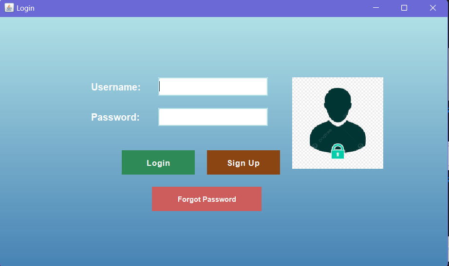
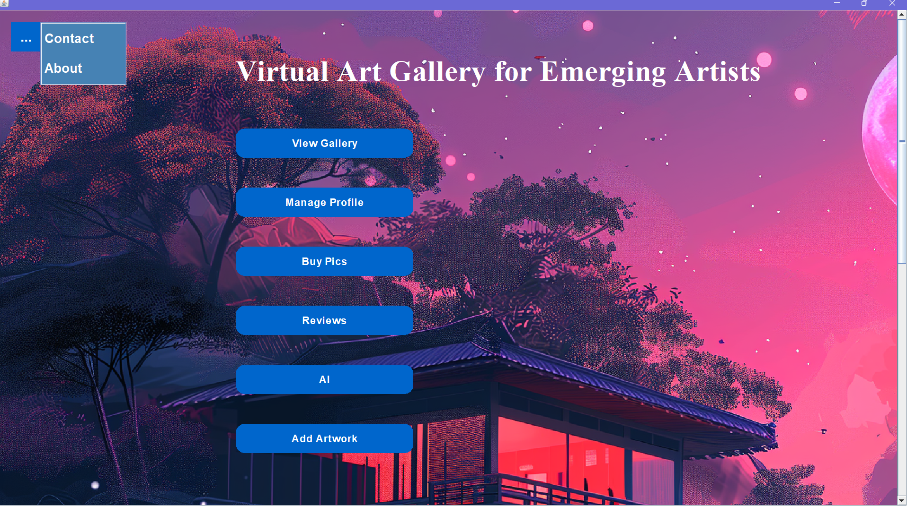
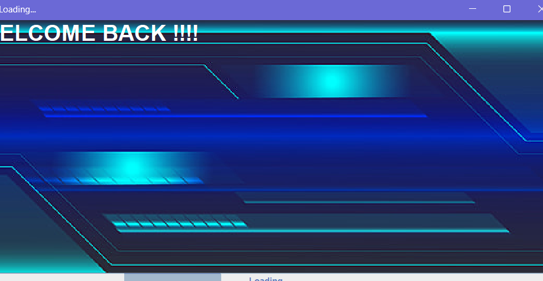
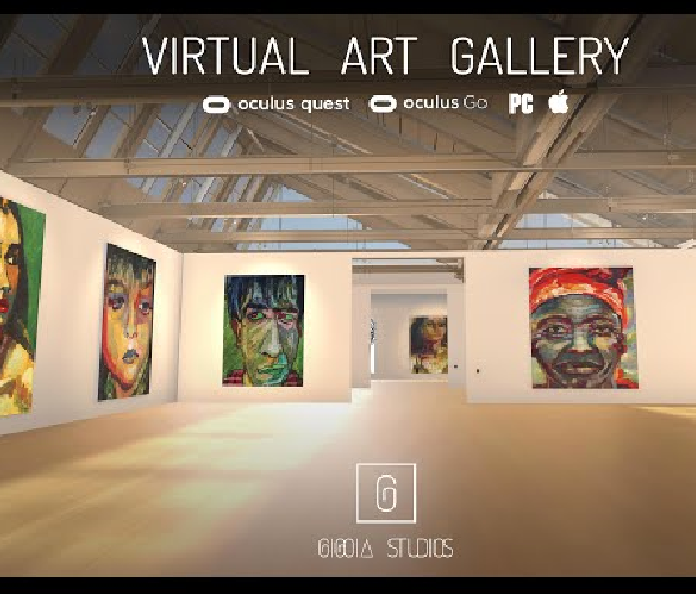
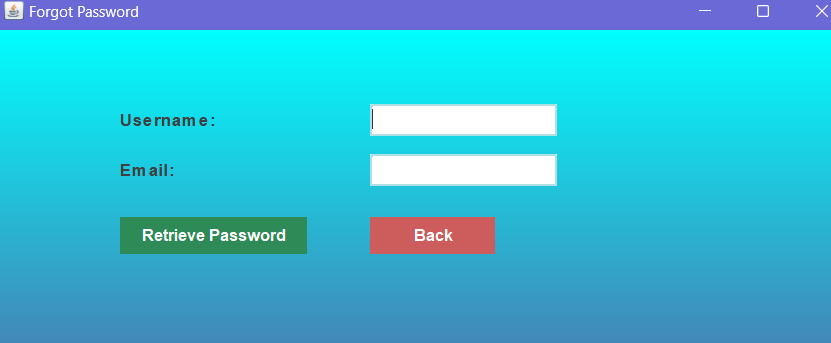
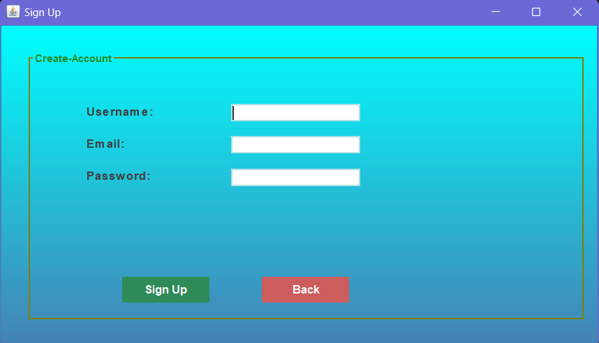

# Virtual Art Gallery

Virtual Art Gallery is a Java-based desktop application created with Swing for the graphical interface and MySQL as the database management system. This project is designed for showcasing and managing an art gallery's digital exhibits.

## Table of Contents
1. [Features](#features)
2. [Requirements](#requirements)
3. [Setup Instructions](#setup-instructions)
   - [1. Clone the Repository](#1-clone-the-repository)
   - [2. Configure Resource Paths](#2-configure-resource-paths)
   - [3. Set Up API Keys](#3-set-up-api-keys)
   - [4. Create MySQL Database and Tables](#4-create-mysql-database-and-tables)
   - [5. Compile and Run](#5-compile-and-run)
4. [Troubleshooting](#troubleshooting)
5. [Screenshots](#screenshots)
6. [License](#license)

## Features
- **User-friendly Interface**: Built using Java Swing for a smooth and interactive user experience.
- **Database Integration**: All artwork, user, and gallery data is stored and managed in a MySQL database.
- **API Integration**: Some APIs are used in this project to enhance functionality.

## Requirements
- **Java**: Ensure Java Development Kit (JDK) is installed on your system.
- **NetBeans IDE**: Developed and tested in NetBeans; you may use other IDEs, but paths may vary.
- **MySQL Database**: Install and configure MySQL; create the necessary tables in your database.

## Setup Instructions

### 1. Clone the Repository
Clone this repository to your local machine.

### 2. Configure Resource Paths
Ensure all image files and resources are placed in the correct file paths as per your local setup:
   - Update paths in the code to match your local directory structure where image files or other resources are stored.
   
### 3. Set Up API Keys
Some functionalities require external APIs. Make sure to:
   - Obtain API keys for any services used.
   - Replace placeholder API keys in the code with your actual keys.

### 4. Create MySQL Database and Tables
   - Open MySQL and create a new database for the project.
   - Import or define the required tables for storing gallery information, user details, artwork metadata, etc.
   - Update your database credentials in the code if necessary.

### 5. Compile and Run
Open the project in NetBeans IDE and run it. Verify that all paths and database connections are correctly configured.

## Troubleshooting
1. **Resource Path Errors**: Check that all file paths for images and other resources are correctly set up.
2. **API Errors**: Make sure API keys are valid and the required APIs are active.
3. **Database Connectivity Issues**: Verify that the MySQL database is running and that your credentials are correctly set.

## Screenshots
Below are screenshots showcasing different parts of the Virtual Art Gallery application.

### 1. Login Screen
 

### 2. Home Screen

### 3. Loading Screen

### 4. Splash Screen

### 5. Forgot Password Screen

### 6. SignUp Screen

> **Note**: Place your screenshots in a folder named `screenshots` within the project directory. Ensure that the paths in this `README.md` file match the folder structure.

## License
This project is open for personal and educational use. Please refer to the LICENSE file for more information.
